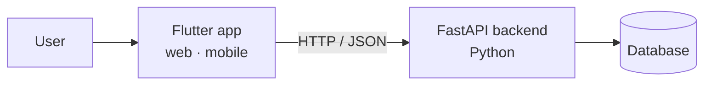

# Unity Fund

A crowdfunding app in the style of GoFundMe, where people publish their needs (personal projects, social causes, community help) and anyone can donate to support them.

Built with **Flutter** on the front end and a **Python (FastAPI)** API on the back end, as a course project at the Instituto Tecnológico de Costa Rica (TEC).

**🔗 Live demo:** [unity-fund-umber.vercel.app](https://unity-fund-umber.vercel.app/)

> **Note:** the backend and database are currently turned off, so the live demo shows the interface only. Signing up, logging in, creating projects and donating won't work there. To try the full app, run the backend locally.


---

## Features

- **User accounts:** sign up with a profile and a personal wallet, then log in.
- **Fundraising projects:** create a project with a description, a funding goal and a category.
- **Edit projects:** update a project's details at any time.
- **Donations:** donate to any project from your wallet and help it reach its goal.
- **Browse causes:** explore projects by category and see how close each one is to its goal.
- **Cross-platform:** one Flutter codebase that runs on the web, Android, iOS and desktop.


## How it works



The Flutter app sends requests to the FastAPI backend, which validates the data with Pydantic models and reads or writes users, projects and donations in the database.

### API endpoints

| Method | Endpoint | What it does |
|---|---|---|
| `POST` | `/registerUser` | Creates a user with their profile, credentials and wallet |
| `POST` | `/userLogIn` | Logs a user in |
| `POST` | `/createProject` | Creates a fundraising project with a goal and categories |
| `POST` | `/updateProject` | Updates an existing project |
| `POST` | `/makeDonation` | Records a donation to a project |
| `GET` | `/readQuery` | Reads data for the app's views |

## Tech

| Layer | Technology |
|---|---|
| Front end | Flutter · Dart |
| Back end | Python · FastAPI · Pydantic · Uvicorn |
| Database | SQL Server (Azure) <!-- add MongoDB here if you used it too --> |
| Hosting | Vercel (web app) |

## Project structure

```
unity_fund/
├── lib/            # Flutter app (screens, widgets, API calls)
├── assets/         # images and other assets
├── web/ android/ ios/ windows/ macos/ linux/   # Flutter platform folders
├── backend/
│   ├── main.py       # FastAPI app and endpoints
│   ├── models.py     # Pydantic models
│   ├── functions.py  # business logic
│   └── db.py         # database connection
└── requirements.txt  # Python dependencies
```

## Getting started

### Requirements

- [Flutter SDK](https://docs.flutter.dev/get-started/install)
- Python 3.10 or newer
- ODBC Driver 17 for SQL Server
- Access to a SQL Server database

### 1. Run the backend

Create a `.env` file (never commit it) with your database credentials:

```
DB_SERVER=your-server.database.windows.net
DB_NAME=your-database
DB_USER=your-user
DB_PASSWORD=your-password
```

Then install the dependencies and start the API:

```bash
pip install -r requirements.txt
uvicorn backend.main:app --reload
```

The API runs at `http://127.0.0.1:8000`, and FastAPI's interactive docs are at `http://127.0.0.1:8000/docs`.

### 2. Run the Flutter app

```bash
flutter pub get
flutter run -d chrome    # or pick an emulator / device
```

## Author

**Tamara Villarevia Navarro** · Computer Engineering student at TEC
[GitHub](https://github.com/B1bisauri0)

<!-- If you built this as a team, add your teammates and what you worked on:
## Team
- Tamara Villarevia Navarro: ...
-->
